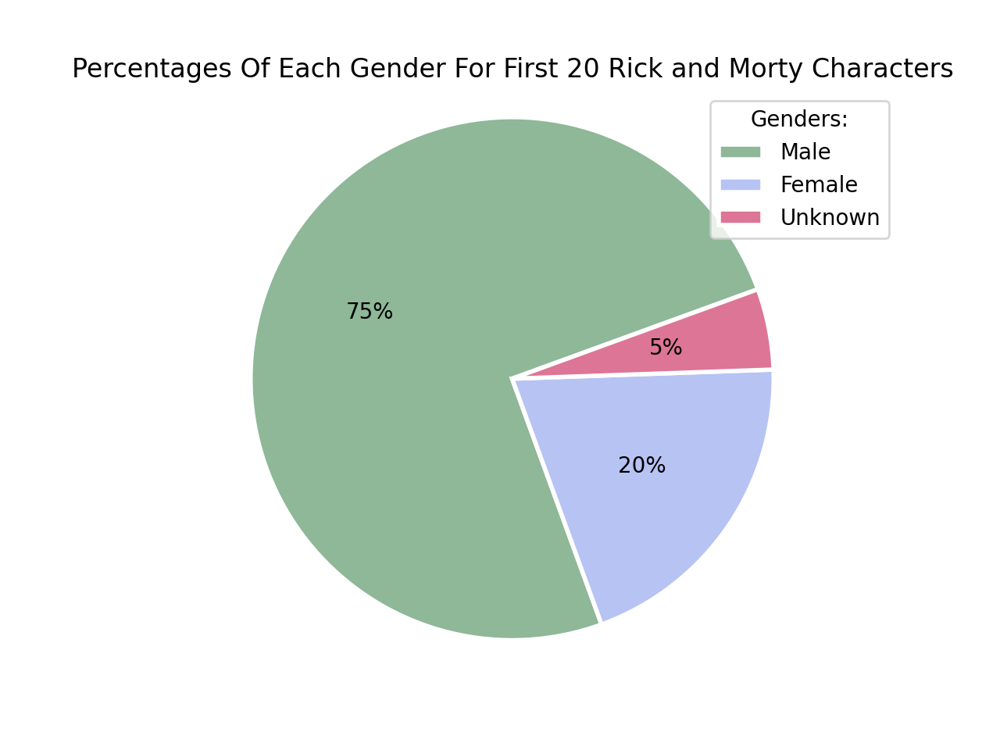

# Rick and Morty Data Visulization

For this project I looked at data for the TV show _Rick and Morty_

**Number of Episodes at a Certain Location**

Here is the link to the [original data set](location.json) for my first graph. In my graph I looked at the first 20 episodes in the data set. I found all the locations mentioned in those 20 episodes and plotted how many of these 20 occurred at a specific location. The locations were: Planet, Cluster, Space Station, Microverse, TV, Resort, Fantasy Town, and Dream. Results show that most of the episodes occur on a Planet!

**Percent of Each Gender**

Here is the link to the [original data set](character.json) for my second graph. This graph compares the percentages of the different genders of the first 20 characters that the data set mentions. The genders mentioned were Male, Female, and Unknown. As seen by the percentages the majority of the 20 characters are male.

Here is the link to this [Project's Instructions](https://github.com/mikeizbicki/cmc-csci040/tree/2021fall/hw_02)
